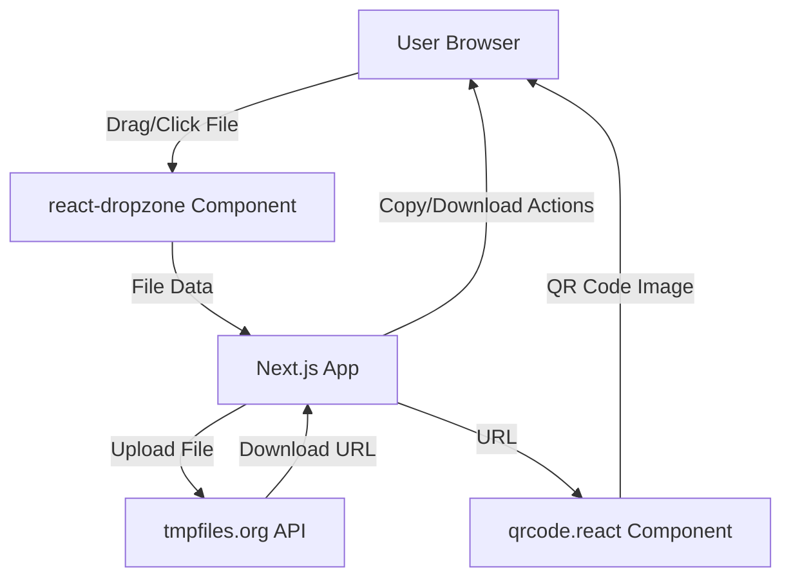
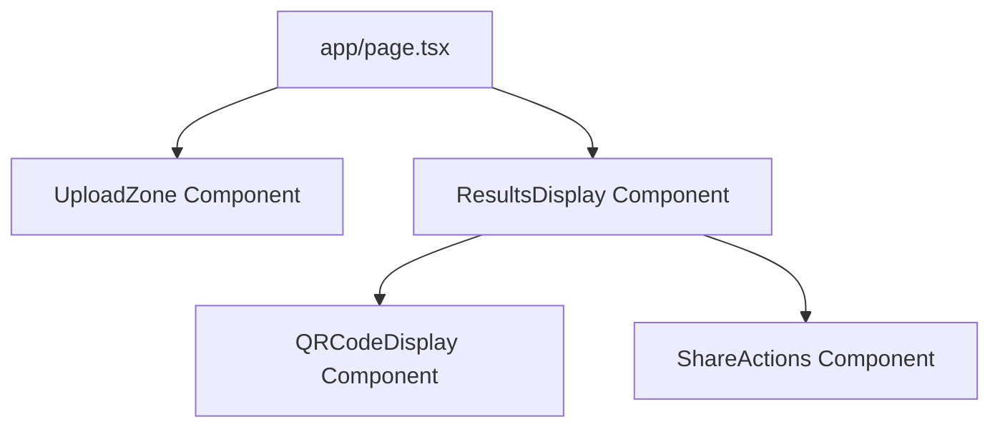

# Design Document: QuickShare QR

## Overview

QuickShare QR is a client-side web application that enables instant file sharing through QR codes. The application follows a simple three-step flow: upload a file, receive a QR code, and share. Built entirely on the client side using Next.js, it leverages tmpfiles.org for temporary file storage and generates QR codes locally in the browser.

The design prioritizes simplicity and zero-infrastructure deployment. There is no backend server, no database, and no authentication system. The entire application runs in the user's browser, making API calls directly to tmpfiles.org for file storage.

Key design principles:
- Client-side only architecture
- Minimal dependencies (Next.js, react-dropzone, qrcode.react)
- Single-page application with no routing
- Progressive disclosure (upload → results)
- Immediate feedback for all user actions

## Architecture

### System Architecture



The architecture is entirely client-side with a single external dependency: tmpfiles.org API. The Next.js application orchestrates the flow between file selection, upload, and QR code generation.

### Component Architecture



The component hierarchy is shallow and straightforward:
- **Page Component**: Root component managing application state
- **UploadZone**: Handles file selection and validation
- **ResultsDisplay**: Container for results after successful upload
- **QRCodeDisplay**: Renders the QR code image
- **ShareActions**: Provides copy and download functionality

## Components and Interfaces

### 1. Page Component (app/page.tsx)

The root component that manages application state and orchestrates the upload flow.

**State:**
```typescript
interface AppState {
  uploadStatus: 'idle' | 'uploading' | 'success' | 'error';
  downloadUrl: string | null;
  fileName: string | null;
  fileSize: number | null;
  errorMessage: string | null;
}
```

**Responsibilities:**
- Manage application state
- Handle file upload to tmpfiles.org
- Coordinate component visibility based on upload status
- Handle error states and display error messages

**Key Methods:**
- `handleFileSelected(file: File)`: Validates file type and initiates upload
- `uploadToTmpFiles(file: File)`: Performs API call to tmpfiles.org
- `handleUploadSuccess(url: string)`: Updates state with download URL
- `handleUploadError(error: Error)`: Processes and displays error messages

### 2. UploadZone Component

Wraps react-dropzone to provide file selection interface.

**Props:**
```typescript
interface UploadZoneProps {
  onFileSelected: (file: File) => void;
  disabled: boolean;
}
```

**Responsibilities:**
- Accept files via drag-and-drop
- Accept files via click-to-browse
- Display visual feedback during drag operations
- Validate file types before passing to parent
- Show selected file name and size

**Configuration:**
- Accepted file types: `.pdf, .docx, .png, .jpg, .jpeg, .gif`
- Single file selection only
- Visual states: idle, drag-over, disabled

### 3. ResultsDisplay Component

Container component that displays results after successful upload.

**Props:**
```typescript
interface ResultsDisplayProps {
  downloadUrl: string;
  fileName: string;
}
```

**Responsibilities:**
- Display download URL as clickable link
- Render QRCodeDisplay component
- Render ShareActions component
- Provide visual hierarchy for results

### 4. QRCodeDisplay Component

Renders QR code using qrcode.react library.

**Props:**
```typescript
interface QRCodeDisplayProps {
  url: string;
}
```

**Responsibilities:**
- Generate QR code from URL
- Display QR code at appropriate size (256x256px recommended)
- Ensure QR code is scannable
- Provide reference for download functionality

**Configuration:**
- Size: 256x256 pixels
- Error correction level: Medium (M)
- Include margin for scanning reliability

### 5. ShareActions Component

Provides copy-to-clipboard and download QR code functionality.

**Props:**
```typescript
interface ShareActionsProps {
  downloadUrl: string;
  qrCodeRef: React.RefObject<HTMLCanvasElement>;
}
```

**Responsibilities:**
- Copy download URL to clipboard
- Display confirmation message after copy
- Download QR code as PNG image
- Handle clipboard API permissions

**Key Methods:**
- `handleCopyToClipboard()`: Uses Clipboard API to copy URL
- `handleDownloadQR()`: Converts canvas to blob and triggers download

## Data Models

### File Metadata

```typescript
interface FileMetadata {
  name: string;
  size: number;
  type: string;
}
```

Represents the uploaded file's metadata displayed to the user.

### Upload Response

```typescript
interface TmpFilesResponse {
  status: string;
  data: {
    url: string;
  };
}
```

Response structure from tmpfiles.org API (based on their documentation).

### Error Types

```typescript
type ErrorType = 
  | 'unsupported_file_type'
  | 'file_too_large'
  | 'network_error'
  | 'api_unavailable'
  | 'unknown_error';

interface AppError {
  type: ErrorType;
  message: string;
  userMessage: string;
}
```

Structured error handling with user-friendly messages.

### Supported File Types

```typescript
const SUPPORTED_TYPES = {
  'application/pdf': ['.pdf'],
  'application/vnd.openxmlformats-officedocument.wordprocessingml.document': ['.docx'],
  'image/png': ['.png'],
  'image/jpeg': ['.jpg', '.jpeg'],
  'image/gif': ['.gif']
} as const;
```

Configuration for file type validation.

